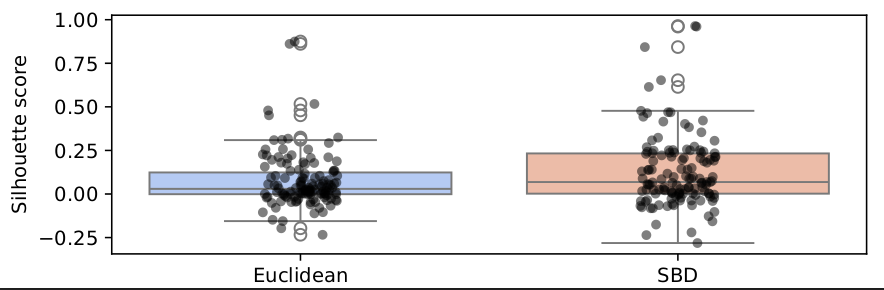
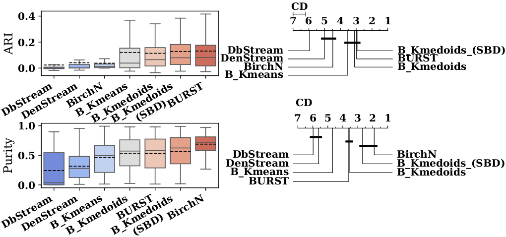
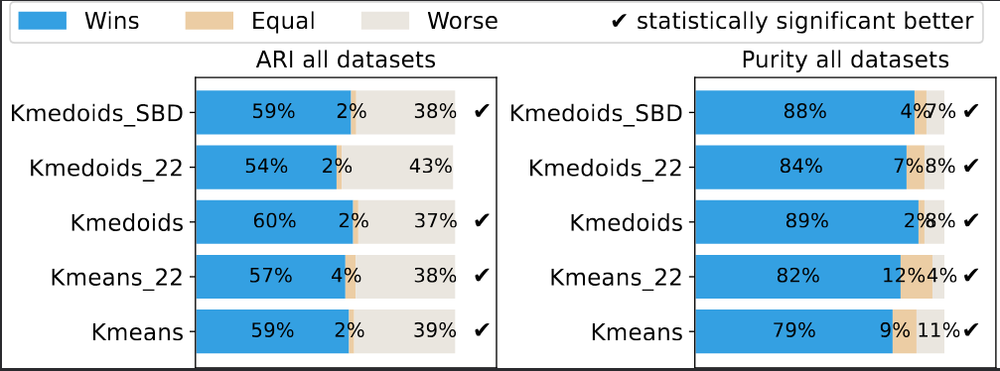
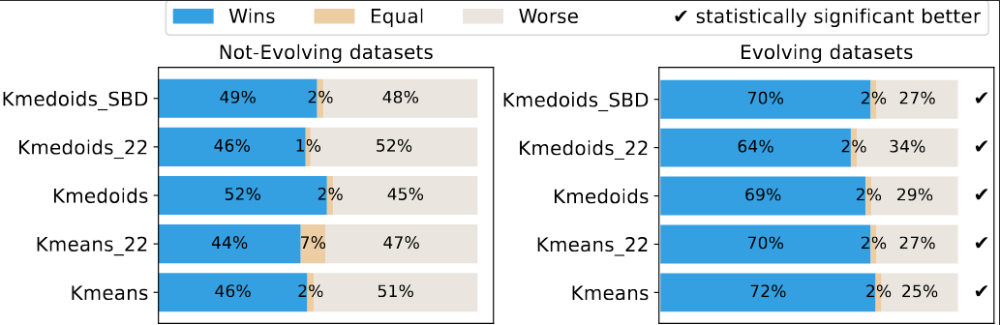

# Additional Figures for BURST effectiveness

## UCR time-series datasets

We use the UCR archive time-series datasets to assess the performance of various 
clustering approaches. Each dataset consists of a collection of time-series, 
normalized using z-score, and tagged with ground truth classes. These are 
treated as streams of time-series data. The UCR time-series benchmark poses 
a significant challenge for clustering, as indicated by low overall silhouette 
scores (Euclidean: median = 0.03, IQR = [0.00–0.12]; SBD: median = 0.07, 
IQR = [0.00–0.23]).

Figure: Shillouette scores for UCR datasets using Euclidean and SBD distances:

## BURST strategy performance

Below figure shows the performance of $k$-medoids and $k$-means variants 
with BURST ($B\_$), compared to $AC$ methods, using both box plots and 
critical diagrams.  The results highlight the superiority of the BURST 
framework  over traditional methods, except in the case of the Birch 
algorithm for the purity metric, as already discussed. Specifically, 
BURST with $k$-means and $k$-medoids performs similarly to BURST with 
$k$-Shapes (referred to as BURST). Additionally, when BURST is combined 
with $k$-medoids, the difference in purity compared to Birch becomes 
statistically insignificant, whereas it was significant with the original BURST.

## Before and after BURST performance

We assess the performance of BURST using $k$-means and $k$-medoids as baseline 
methods, in both cases of providing predefined $k$ ($KC$ setting) and using AutoKC for 
automatic clustering ($AC$ setting). Below figure shows the performance 
improvement (in the $KC$ setting) in terms of ARI and Purity when the BURST 
framework is applied to baseline variants. In all cases, BURST results 
in more wins (i.e., better performance) than the baseline methods. 
Moreover, in all but one case, BURST leads to statistically significantly 
better performance. To assess whether BURST results in statistically 
significant improvements, we perform pairwise comparisons (between 
performance with and without BURST) using the Wilcoxon test, 
testing whether the application of BURST yields significantly better results.

Looking at the performance improvement, but this time seperatly on evolving 
and stationary datasets, we can see that the performance gain is more 
pronounced on evolving datasets.

